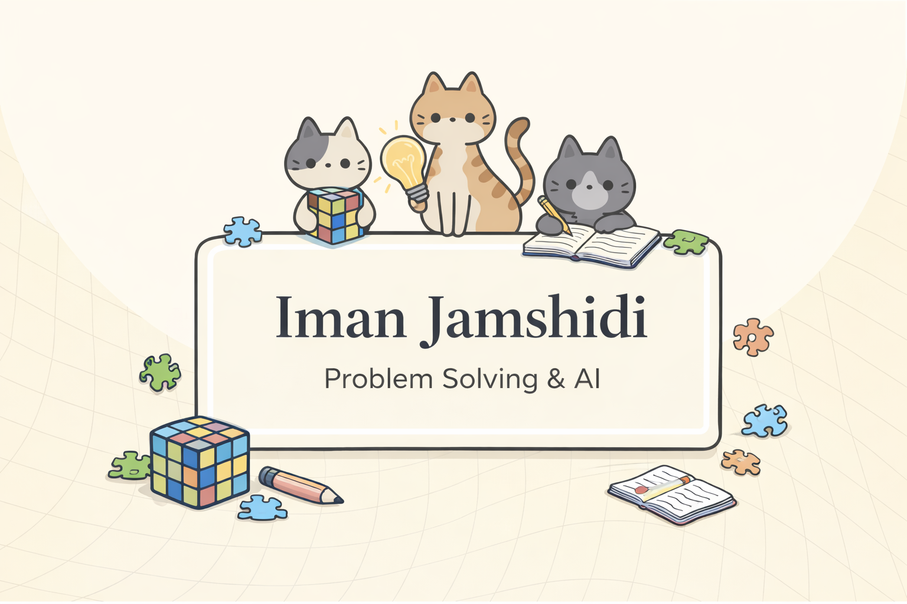

## Hi there 👋

- 🌱 I’m an MEng student in **Artificial Intelligence** at the **University of Cincinnati**.
- ⚡ I’m interested in **Machine Learning, Deep Learning, and Applied AI**, with a strong focus on problem solving and mathematical reasoning.
- 🧠 Background in **data analysis, analytics, and system design**, with experience across academic projects and real-world systems.
- 🎯 Outside of tech, I enjoy strategic thinking, puzzles, and mind games like chess.
- 📫 How to reach me: **imanjamshidi87@gmail.com** or **jamshiin@mail.uc.edu**
